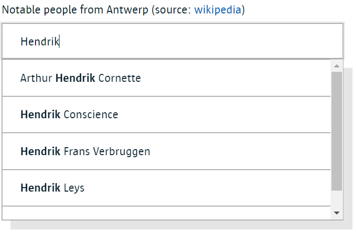

# Contact Picker Smart Widget UI (Angular)

This is the Angular 5+ UI for a Smart Widget implementing a picker field to choose a person from a list of contacts. It is matched by a [corresponding back-end service](https://github.com/jsebrech/contact-picker-service-nodejs) which is needed when running it in remote mode. A default implementation for selecting people from [CRS Medewerker](https://acpaas.digipolis.be/nl/product/crs-medewerker) is provided.



There is a demo app, see below for instructions on running it.

## How to use

### Installing

Copy the .npmrc file from this repo to your local repo to set up the link to nexusrepo.antwerpen.be npm repository.

Then run:
```
$ npm install @acpaas-ui/contact-picker-widget-angular
```

### Local mode

In this mode, the data backing the picker is passed from the surrounding application code instead of fetched from a remote back-end.

In your template:

```html
<aui-contact-picker
    [data]="listOfPeople"
    [(value)]="person">
</aui-contact-picker>
```

In the component code:

```ts
class YourComponent {

    // you can assign an initial value here
    person: ContactPickerValue;

    listOfPeople: ContactPickerValue[] = [
        { id: '0', name: 'Abraham Ortelius', ... },
        ...
    ];

    ...
}
```

Every value in the backing list must have a unique id. If names can be the same it is recommended to use a differentiator as described below.

Supported attributes:

- **data**: An array of value objects to use as the backing store
- **value**: The current value of the picker, represented as a value object
- **placeholder**: specify the text to show in an empty field
- **noDataMessage**: the text shown in the list when there are no matching results
- **differentiator**: a field from the backing value object to be displayed as a *tag* on the right side of the list items, to help the user discern the difference between multiple matches with the same name.

    `<aui-contact-picker differentiator="userName" ...`
    

Events:

- **valueChange**: triggers when the current value is changed (or cleared)

### Remote mode

In this mode, the picker is backed by a remote service queried for results matching what the user types.

```html
<aui-contact-picker
    [(value)]="person"
    url="/api/people">
</aui-contact-picker>
```

Additional attributes:
- **url**: the URL of the back-end service feeding this widget
- **bufferInputMs**: how long to buffer keystrokes before fetching remote results

The backing service implements the following protocol:

- GET /path/to/endpoint?search=...
- search = the text that the user typed on which to match
- result = JSON-encoded array of [ContactPickerValue](src/contact-picker/contact-picker.value.ts) objects

## Run the demo app

Set up the .npmrc (see above), then run:

```sh
> npm install
> npm start
```

Browse to [localhost:4200](http://localhost:4200)

To use the remote page, you will need to have also started [the backing service](https://github.com/digipolisantwerp/contact-picker_service_nodejs).

## Contributing

We welcome your bug reports and pull requests.

Please see our [contribution guide](CONTRIBUTING.md).

## License

This project is published under the [MIT license](LICENSE.md).
